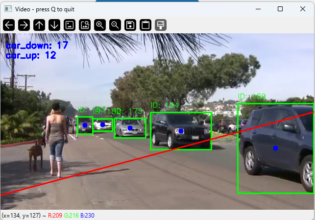
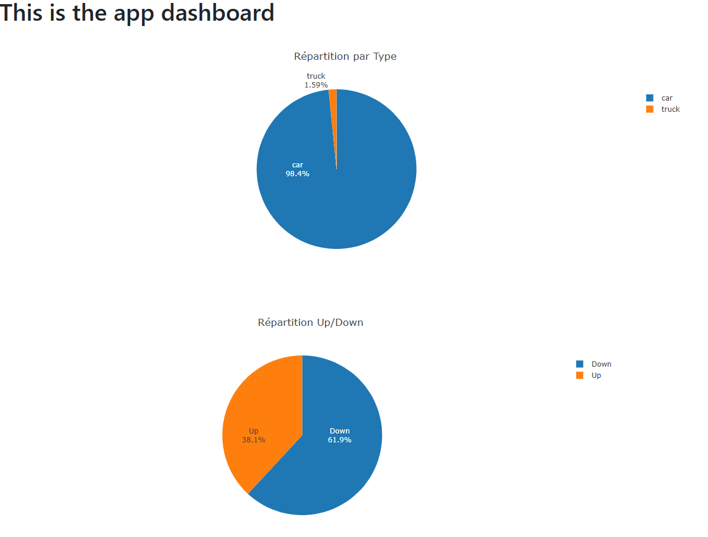

# Vehicle Counting with YOLO11 and Flask Dashboard
## Description
Ce mini projet utilise le modèle YOLO11 pour détecter et compter les véhicules (voitures, camions, vélos, etc.) passant sur une vidéo, qu'elle soit en direct ou préenregistrée. Les statistiques issues de cette analyse sont ensuite affichées sur un dashboard interactif via une interface web développée avec Flask.
  
L'application différencie également :
- Le sens de passage des véhicules.
- Le type de véhicule détecté.




## Installation   
Cloner le repo :  
`git clone https://github.com/eltar14/projet-comptage.git`

Créer un venv :  
`python -m venv venvcomptage`
puis  
`source venvcomptage/bin/activate` (Linux/Mac)  
`.\venvcomptage\Scripts\activate` (Windows) 


Installer les dépendances  
`pip install -r requirements.txt`

Il vous faudra aussi télécharger une vidéo avec des voitures qui passent : 
[https://www.youtube.com/watch?v=e_WBuBqS9h8](https://www.youtube.com/watch?v=e_WBuBqS9h8)


## Lancer l'application 
`python main.py`  
L'application lancera deux processus en parallèle :

- L'API Flask (appel via [http://localhost:5000/counts](http://localhost:5000/counts)).
- La boucle de détection et de suivi des véhicules

Une fenêtre s'ouvrira pour afficher les détections en direct avec les bounding boxes et les trajectoires des véhicules détectés.  
Vous pouvez accéder aux statistiques via le dashboard à l'URL suivante :
[index.html](web/index.html) (dans web/).

Remarque : YOLO11n.pt a été inclus dans le repo en raison de son poids léger mais il est recommandé d'utiliser une version plus puissante comme yolo11m.pt

## Configuration avancée
### Ajuster la ligne de comptage  
La ligne de comptage des véhicules est définie par des coordonnées dans la variable *line_points*. Modifiez ces coordonnées pour l'adapter à votre vidéo :  
`line_points = (0, 330, 640, 160)  # x1, y1, x2, y2`

### Documentation des endpoints API
- `GET /counts`  
Renvoie les statistiques des véhicules comptés sous format JSON.
  
Exemple de réponse :  
```json
{
  "data": {
    "car_down": 40,
    "car_up": 21,
    "truck_down": 2
  }
}
```


## Choix techniques  
### YOLO11 pour la détection d'objets
Le choix de YOLO (You Only Look Once) repose sur ses performances en détection d'objets en temps réel.

- Pourquoi YOLO11 ? :  
YOLO11 offre un bon compromis entre rapidité et précision grâce à ses améliorations par rapport aux versions précédentes (meilleure gestion des petites détections, optimisations mémoire).

### OpenCV pour la manipulation vidéo
OpenCV permet une gestion efficace des flux vidéo en direct ou en différé :  
- Capture et décodage des frames vidéo.
- Manipulations diverses comme le redimensionnement, les masques ou l'annotation des images avec les bounding boxes des véhicules détectés.


### Flask pour l'interface web
Flask est un micro-framework léger et rapide, idéal pour une application web simple :  
- Serveur HTTP pour afficher le dashboard.
- Gestion des endpoints pour envoyer les données de détection et les statistiques au front-end.

### Plotly pour des graphiques  
Plotly permet de créer des graphiques interactifs directement dans le navigateur :
- Visualisation dynamique des types de véhicules détectés.
- Statistiques sur le sens de passage des véhicules.
- Et bien d'autres en fonction du besoin  

## Fonctionnalités

- Détection en temps réel ou sur des vidéos enregistrées.
- Affichage des statistiques sous forme de graphiques interactifs sur le dashboard.
- Différenciation des types de véhicules (camions, voitures, vélos).
- Calcul du trafic selon le sens de passage.


## Améliorations possibles
- Amélioration du tracking des véhicules (qui est actuellement rudimentaire)
- Ajout de prédictions avancées : détection d'événements anormaux dans le trafic (embouteillages, contre-sens).
- Exportation des données : ajouter la possibilité de sauvegarder les résultats au format CSV.